# Service Oriented Architecture

Infrastruttura di integrazione di servizi software, che permette di creare applicazioni distribuite, basate su servizi, in modo efficiente e scalabile.

## Pima e dopo SOA

Prima di SOA, le applicazioni erano monolitiche, ovvero composte da un unico blocco di codice. Questo rendeva difficile la manutenzione e l'aggiornamento delle applicazioni, in quanto era necessario modificare l'intero codice sorgente. Essendo la funzione aziendale molto grande, dovrà accedere e modificare diversi dati in database diversi.

Con l'avvento di SOA, le applicazioni sono state suddivise in servizi software, che possono essere sviluppati, testati e distribuiti in modo indipendente. Questo ha permesso di creare applicazioni distribuite, basate su servizi, che possono essere facilmente scalate e aggiornate.
Dai grandi monoliti vengono estratte funzionalità e servizi che possono essere utilizzati da più applicazioni : ** Reusable Business Services **.

## stratificazione del software

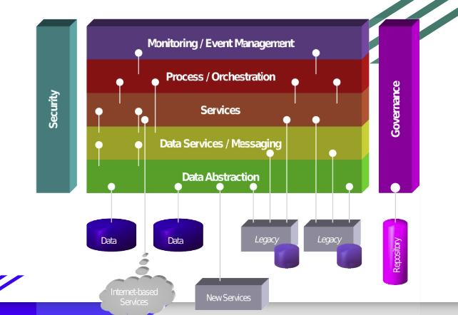

- Data Abstraction: livello dei dati che si collega ai DB relazionali
- New services: servizi esterni
- Legacy systems: servizi interni già esistenti e che non possono essere modificati
- Data services / Messaging: un layer intermedio che fa da wrapper tra i servizi e i dati, i servizi posso sia prendere direttamente i datidai layer sottostanti o passare attraverso il layer di data services per avere un'interfaccia unica
- Servizi: tabnti servizi per le funzionalità aziendati
- Processo / Orchstrazione: non mi basta usare un servizio per arraivare ad un obbiettivo, devo comporre più servizi per ottenere un risultato
- MOnitoring: monitoraggio dei servizi(hogh availability) e delle performance
- Security: sicurezza dei servizi
- Governance: gestione dei servizi e delle policy

## Web Services SOAP

Corba: object request broker (ORB) per la comunicazione tra oggetti distribuiti che permetteva di far comunicare oggetti scritti in diversi linguaggi di programmazione.

Dopo arrivato XML con Web Services SOAP, che permette di far comunicare applicazioni scritte in diversi linguaggi di programmazione e che girano su diversi sistemi operativi.

### Web usage shift

Il web passa da human centric a application centric, ovvero da un web in cui l'utente naviga tra le pagine web (transazioni iniziate dall' utente), a un web in cui il grosso è fatto dalle applicazioni comunicano tra loro (Es. ricerca compagnie aeree online).

### Cosa sono i Web Services?

- Incapsulati: i servizi sono indipendenti e possono essere utilizzati da più applicazioni
- loosely coupled: i servizi sono indipendenti e possono essere utilizzati da più applicazioni
- contracted software objects: i servizi sono definiti da un contratto, che specifica i parametri di input e output (rispettare le api)
- Disponibili sulla rete
- Usano standard XML per la comunicazione
- Indipendenti da OS e linguaggio di programmazione
- Autodescriventi tramite XML
- Published public interface: possono avere metodi privati che non sono accessibili dallesterno

Applicazioni create attaverso componenti distribuite sul WWW

3 standard basati su XML:

- WSDL: Web Services Description Language (linguaggio per descrivere i servizi, descrizione statica)
- SOAP: Simple Object Access Protocol (protocollo di comunicazione per richiamare procedure remote, usata a runtime)
- UDDI: Universal Description, Discovery and Integration (registri di servizi, una sorta di elenco telefonico per servizi, serve per ricercare servizi)

### Il modello

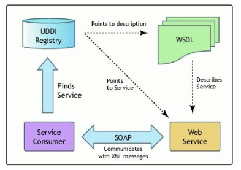

- Web service: componente autonoma che esegue un compito specifico, non si basa su altro, al massimo può invocare altro
- Viene scritto il WSDL che descrive il servizio, abbiamo visto tramite annotazioni e beans in java
- UDDI contiene un entry per ogni servizio offerto che punta al WSDL giusto, in più che la url di reindirizzamento al service specifico
- Il client cerca il servizio tramite UDDI, trova il WSDL e l'url per il servizio e invoca il servizio tramite SOAP

Publish: reistrati in UDDI
Find: cerca in UDDI
Bind: invoca il servizio passando i parametri in modo giusto

### Discoverable

Aggiungendo delle info di semantica alla descrizione dei WS si poteva magicamente trovare a runtime durante lesecuzione

### Protocolli

- Contracted: la descrizione è visibile al consumatore
- Protocolli standard:
- - TCP/IP: trasporto (soap può comunicare su tcp/ip non come rest solo su http, )
- - HTTP: trasporto (soap può comunicare su tcp/ip non come rest solo su http, )
- - XML: dialetti WSlD e SOAP e UDDI

### Remote Procedure Call (RPC) style

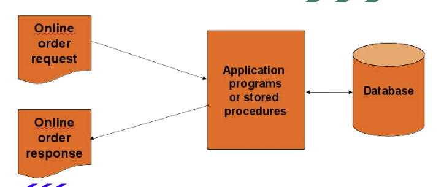

Invio di un messaggio SOAP con un metodo e dei parametri, il servizio elabora la richiesta e manda la risposta in modo sincrono

### Document style

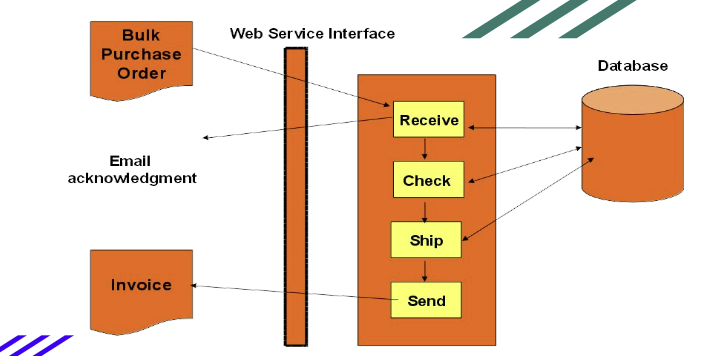

Usa messaggi asincroni

- Ricevo lordine
- Invio la mail
- controllo il db
- invio la conferma dellordine solo alla fine

### Formato dei messaggi SOAP

- SOAP Header: informazioni di servizio
- SOAP Body: contenuto del messaggio

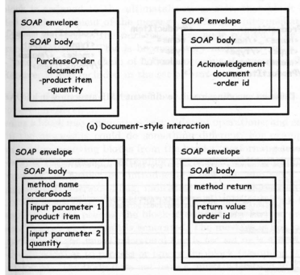

Nel document style il body contiene il payload(es. ordine), nel RPC style il body contiene il metodo e i parametri formali e attuali

Nel ritorno in document style il body contiene l'ack, nel RPC style il body contiene il valore di ritorno

#### Gestione eccezioni

- Fault: eccezione
- Code: codice errore
  bisoogna gestire le eccezioni in modo da non far crashare il servizio

### WSDL

Descrivo la parte astrastta che contiene la descrizione ad alto livello delle funzionalità offerte dal servizio, la parte dettagliata invece descrive com bisogna invocare il servizio

Definizioni:

- Types: tipi di dati usati dal servizio
- Message: tipi di messaggi scambiati
- Operation: operazioni offerte dal servizio
- PortType: interfaccia del servizio (come invoco quella operazione)
- Binding: protocollo e formato dei messaggi (connetto il formato dellinvocazione con il protocollo su cui viaggia la richiesta)
- Service: endpoint del servizio

#### portType

- one way: invio un messaggio e non aspetto risposta
- request response: invio un messaggio e aspetto risposta
- solicit response: hey dammi la riposta che sto aspettando
- notification: una notifica

ORA SI CAPISCE PERCHè è COSì POTENTE, MI PERMETTE DI FARE PROGRAMMAZIONE DISTRIBUITA IN MODO FACILE, IN REST POSSO SOLAMENTE FARE RICHIESTE E ASPETTARMI DEI DATI IN RITORNO, IN SOAP POSSO FARE UNA VERA E PROPRIA PROGRAMMAZIONE DISTRIBUITA, RICHIAMARE METODI DI ALTRI

### Domande a cui vogliamo rispondere

- Chi mette a disposizione il servizio?
- é gratis?
- Che Quality of Service ci aspettiamo? (es. carte di credito, dati sensibili)
- Quale tipo di business mette a disposizione il servizio?
- Quali altri servizi sono disponibili per il mio servizio?

## UDDI

Lanciato da IBM e Microsoft

### Architettura

- UDDI data model: XML schema per descrivere i servizi e le aziende
- UDDI api:api SOAP per interrogare il registro e pubblicare servizi
- UDDI cloud service: sincronizzazione tra registri

### UDDI XML schema

Definisce quattro tipi di informazioni:

- Business: informazioni sullazienda(anche di contatto)
- Service: informazioni sul servizio a livello generale in linguaggio naturale
- Binding information: informazioni specifiche su come invocare il servizioù
- Service specification information: informazioni generale sulle api
  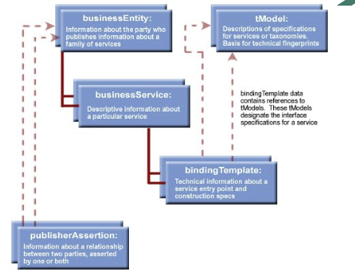
  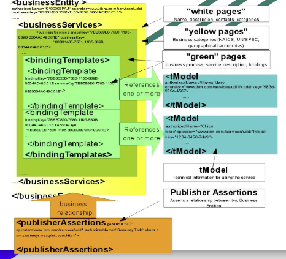

### Mappare WSDL in UDDI

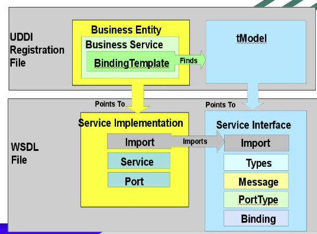

dal binding template si trova lindiirizzo del servizio

### Come si fa in Java?

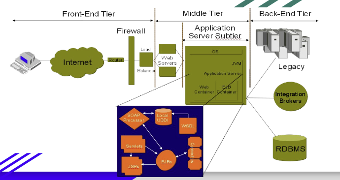

** Ora possiamo avere sia la nostra logica interna per offrire il servizio di ricerca di un volo per la nostr compagnia aerea e inoltre tramite soap possiamo offrire il servizio di ricerca a terzi che vogliono integrare il nostro servizio di ricerca voli nei loro siti ** non duplico il codice

## BPEL (Business Process Execution Language)

Linguaggio XML per definire processi di business che coordinano l'esecuzione di servizi web in un ambiente distribuito.

## REST e JSON

### REST

- Representational State Transfer
- Architettura software per la creazione di servizi web
- Basata su HTTP
- Stateless: non mantiene lo stato della sessione
- CRUD operations: Create, Read, Update, Delete
- Risorse: dati o funzionalità esposti tramite un URI
- HTTP methods: GET, POST, PUT, DELETE
- Formati dati: XML, JSON, HTML, testo
- Scalabile e performante
- Facile da usare

### Architettura

- Due servizi checomunicano
- Serializzazione dei dati in JSON o XML
- Interfaccia uniforme: post, get, put, delete
- Risorsa: dati o funzionalità esposti tramite un URI

### RESTfull services

- lightweight
- usa solo HTTP
- Stateless
- mette a disposizione una struttura a cartelle di uri
- trasferisce JSON o XML

### REST vs SOAP

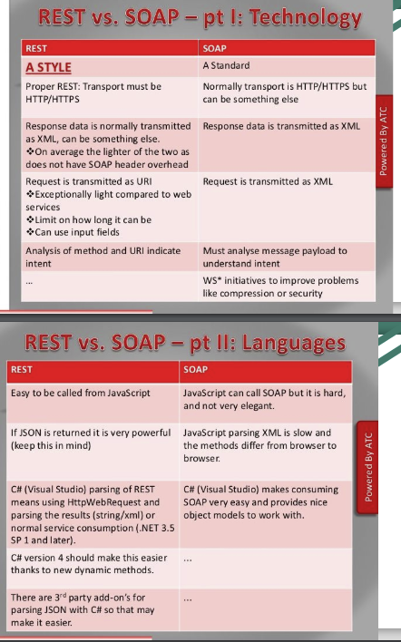
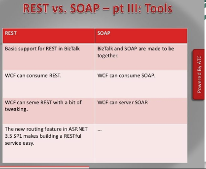

### JSON

Lista ordinata di valori, oggetti o array

Fatto da chiave e valore

```
{
  "name": "John",
  "age": 30,
  "cars": {
    "car1": "Ford",
    "car2": "BMW",
    "car3": "Fiat"
  }
}
```

### JSON vs XML

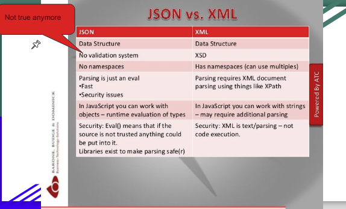

### Comparazione REST e WS

<!-- Basically, you would want to use RESTful web services for integration
over the web and use big web services in enterprise application
integration scenarios that have advanced quality of service (QoS)
requirements.
● JAX-WS: addresses advanced QoS requirements commonly occurring in
enterprise computing. When compared to JAX-RS, JAX-WS makes it
easier to support the WS-* set of protocols, which provide standards for
security and reliability, among other things, and interoperate with other
WS-* conforming clients and servers.
80
Comparison REST and WS
● JAX-RS: makes it easier to write web applications that apply some or
all of the constraints of the REST style to induce desirable properties
in the application, such as loose coupling (evolving the server is easier
without breaking existing clients), scalability (start small and grow),
and architectural simplicity (use off-the-shelf components, such as
proxies or HTTP routers). You would choose to use JAX-RS for your
web application because it is easier for many types of clients to
consume RESTful web services while enabling the server side to
evolve and scale. Clients can choose to consume some or all aspects
of the service and mash it up with other web-based services. -->

Sostanzialmente se vogliamo fare integrazione via web usiamo REST, se vogliamo fare integrazione in un'azienda usiamo WS
