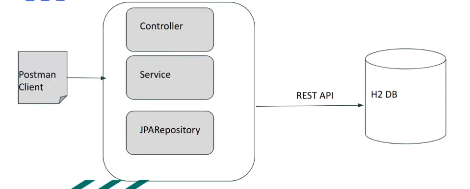
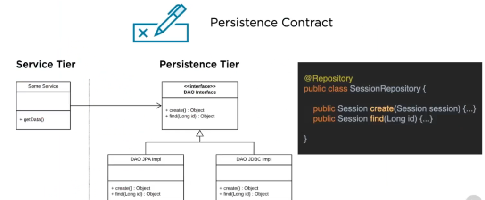
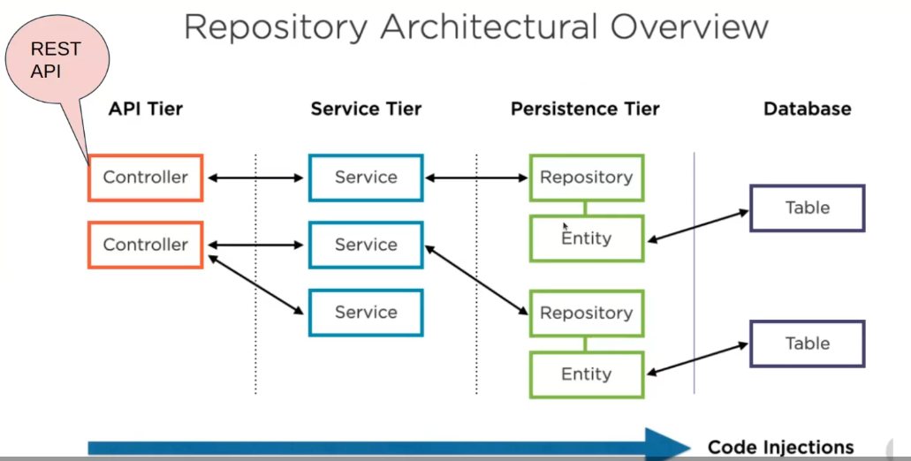
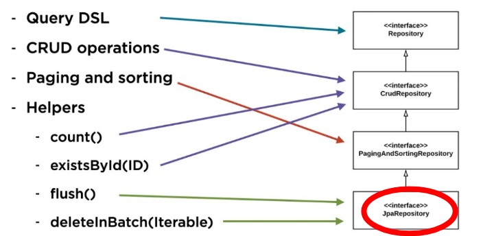

# Docker

## Spring Data Rest

### Cosa può fare?

Con spring/spring data poossiamo creare dei servizi (Web services REST)
Offriamo un backend con dei servizi che rimane costande e indipendente da l frontend
Usiamo il pattern MVC intrinsicamente: il backend offre il model e ctroller

### API REST

Abbiamo diverssi livelli che partono dallavere uninterfaccia con uri con XML fino ad avere uninterfaccia pulita con HTTP e JSON

- Interfaccia uniforme esposta su HTTP.

### Utilizzo di Spring Data REST

- Spring Data Repository
- CrudRepository
- Spring Data REST = Spring Data + REST API

### Struttura di Spring Data REST


Quando costruisco il backend non ho bisogno del frontend

- Business Logic
  - Controller: offre gli endpoint rest e richiama i service
  - Service: realizzano la business logic
  - JPARepository: accede ai dati
- Formato JSON per le risposte.

Posso avere unulteriore chaimata rest per accedere al database

## Esempio di API Rest Web Service

- Endpoint: `/api/v1`
- Risposta HTTP in formato JSON.

## Profili

Fasciloe mantenere dicverse versioni, con database divesi

- Development
- Test
- Production: usato dal committente

## Mapping con Spring Boot

- Esempio di interfaccia repository:

```java
public interface CustomerRepository extends JpaRepository<Customer, Integer> {}
```

URL di esempio: http://localhost:8080/customers

Esempio di annotazione @RepositoryRestResource:

```java
@RepositoryRestResource(path="travels")
public interface TravelRepository extends JpaRepository<Travel, Integer> {}
```

URL di esempio: http://localhost:8080/travels

## Dipendenze

Dipendenza per Spring Data REST:

```xml
<dependency>
    <groupId>org.springframework.boot</groupId>
    <artifactId>spring-boot-starter-data-rest</artifactId>
</dependency>
```

## Integrazione con Spring

Esempio di Web Service con Spring Integration
Controller REST:

```java
@RestController
public class AccountController {

    @GetMapping("/account/{id}")
    public Account find(@PathVariable int id) {
    // Ricerca account per id
    }
}
```

## Cosa succede a livello dei dati?



Service tier fa parte della business logic che richiama il Persistence tier (parte delle enità)

Posso avere diverse implementazioni JPA o JDBC tutto viene fatto tramite Injection



- Entità: rappresentano le tabelle del database.
- Repository: interfacce che estendono JpaRepository.???? GEstiscono la molteplicità delle entità(create, read, update, delete)
- Service: (opzionale) implementano la business logic, la scompongono in metodi più piccoli.
- Controller: espongono i servizi REST.

### Gerarchia di JPA Repository



## Spring Cloud

facciamo dopo
