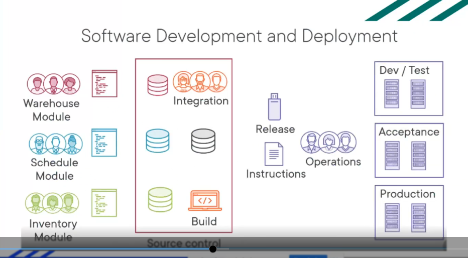
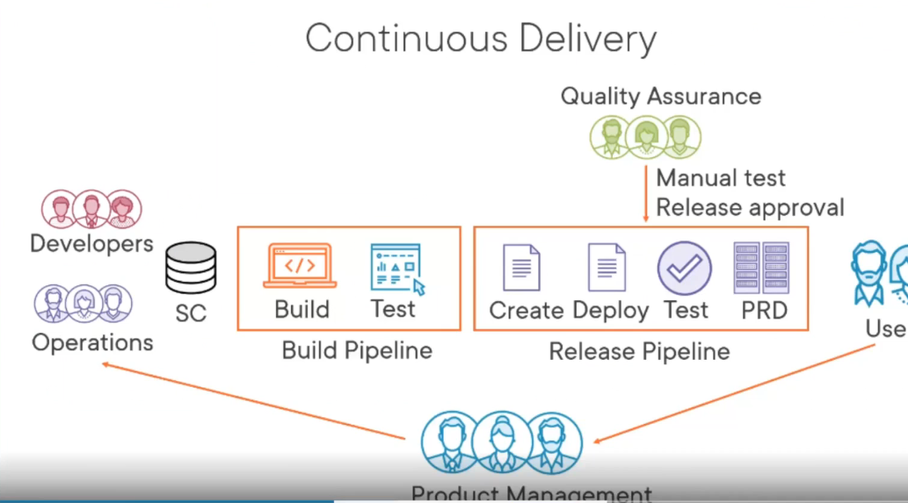
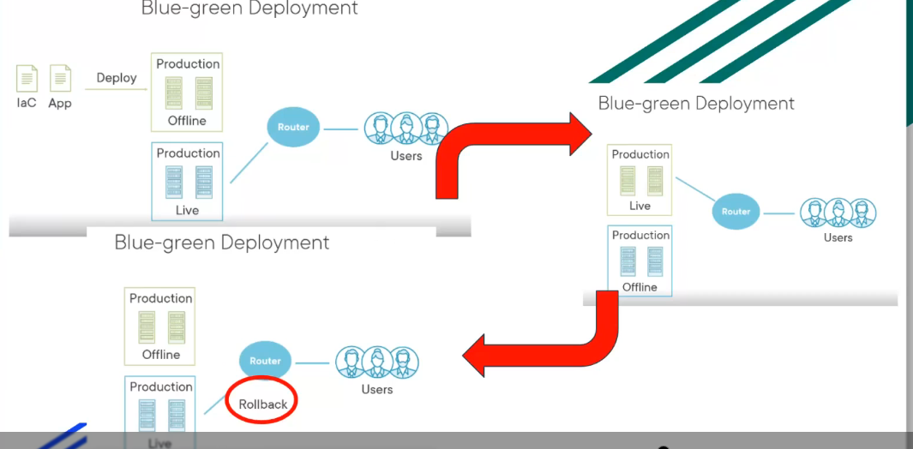
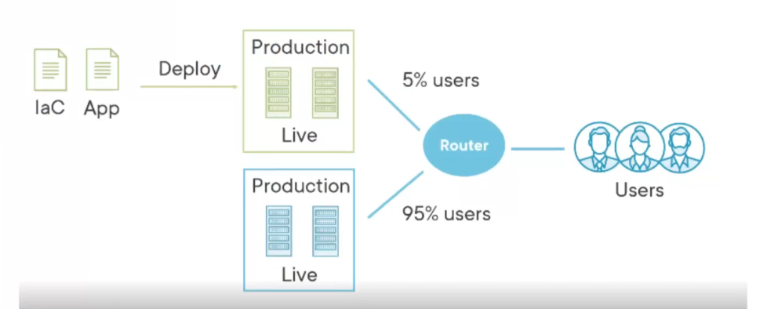
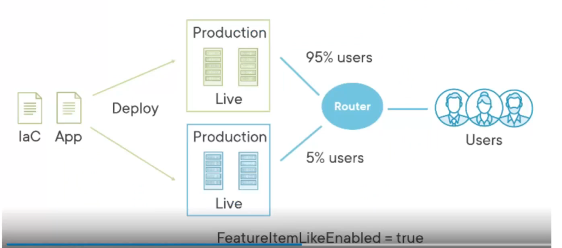
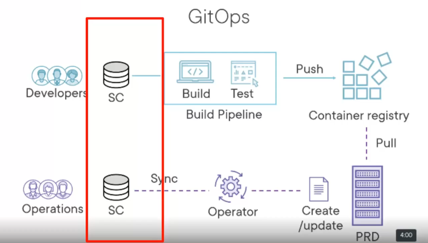
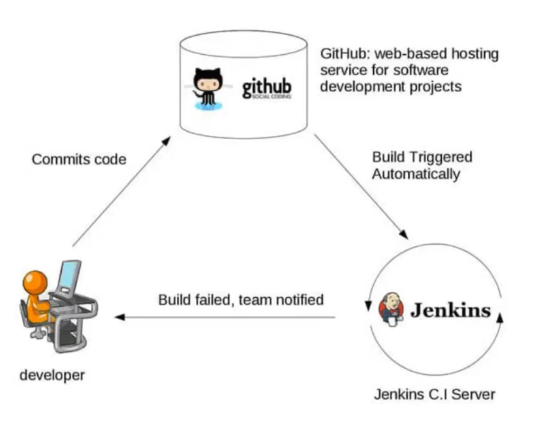

# Countinuous integration and delivery

## Automazione

- non sarebbe potuto esistere con unarchitettura monolitica: impossibilie fare test e deploy di tutto quanto insieme
- anche il controllo di versione funziona bene con i microservizi
- in più posso sostituire velocemente le immagini dentreo i pod per non mandare down per cambiare
- con le action (github) posso fare il testing e il deploy in automatico allo scattare di certi eventi
- avere diversi server su cui girano diverse versionni, produzione, test, sviluppo e posso mandare i test su quello che volgio
- posso construire dei nuovi target per le nuove architetture che devo integrare(nuovo telefono)

## Dove e perchè metto questo tool?

dobbiamo mettere daccordo i vari team di persone che lavorano:

- sviluppatori
- product management: cosa deve fare il prodotto e come deve essere fatto, si occupa di fare il ponte tra sviluppatori e clienti
- integration e operations: consegnano, testano e integrano il prodotto

l'idea e di ridurre al minimo la parte di integrazione e operations(iterazioni corte), per fare questo dobbiamo automatizzare il più possibile

alla fine di ogni iterazione:

- merging dei moduli sul main
- build del codice
- deploy del codice

## deploy

team di integrazione fa la build e passa al team operations una release e delle istruzioni e dovreanno gestire i 3 ambienti di sviluppo, test , accepance e produzione e si decide poi cosa dare al cliente

source control: git

## cosa si può migliorare?

- la build è manuale: integrazione
- il deploy è manuale: operations

miglioramenti:

- migliore qualità
- delivery veloce
- riduzione dei costi
- più flessibilità

## continuous delivery

se il codice è molto può esserci la quality assurance che fa il testing da persone esterne

## IMPORTANTE

- per poterci essere questa continuazione bisogna avere un unico ambiente(git)
- bisogna avere le commit piccole e frequenti
- ogni commit triggera una build: troppe?
- automazione dei test
- tutti hanno accesso allaultima versione

## differenza tra continuous deployment e continuous delivery

delivery: Il software può essere rilasciato in produzione in qualsiasi momento

deployment: il software è rilasciato in produzione in automatico tutte le volte

con piccole immagini di kubernetes è uguale

## Blue green deployment

router: posso indirizzare dove voglio con apigateway
devo far testare nuova versione?
cambio da blu a verde dal router gli utenti la usano e se non va a buon fine faccio rollback, velocissimo cambio solamente i lkservizio

## canary deployment

sono più incerto non sposto tutti gli utenti ma solo una parte e vedo se va bene
ho un confronto tra la nuova e la vecchia versione

## feature flags

ho dei flag nel codice che mi permette di dare le features nuove solamente a una parte degli utenti(o stampare cose)

## git ops

# Jenkins

primo strumento di CI/CD
oggi github actions è molto più usato

## come funziona

- modello ad eventi
- vengono startate delle build e dei deploy automatici
- posso stabilire delle policy per test e integrazioni
- IDEA:se faccio cose(test e build) frequenti scoprop prima i problemi

- posso fare testing anche negli stage

# Github actions

- githubflow: posso averre la visione strutturata dei branch
- posso fare depoloy sul cloud in modo automatico
- custom workflow: posso fare quello che voglio
  - aspetto lgie eventi
  - automatizzo gitflow
