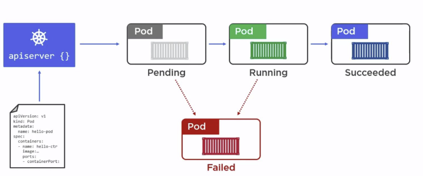
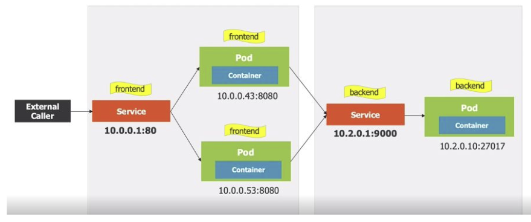
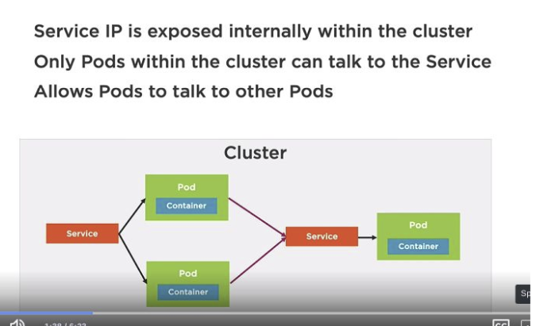
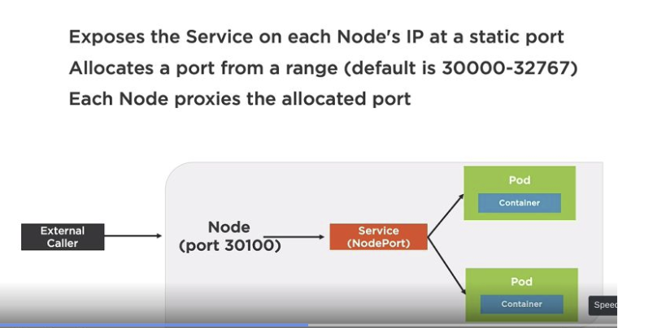
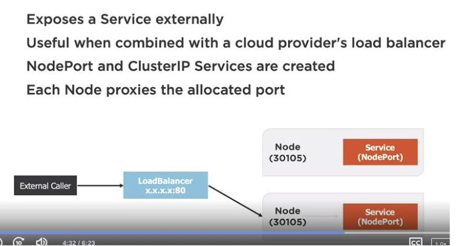
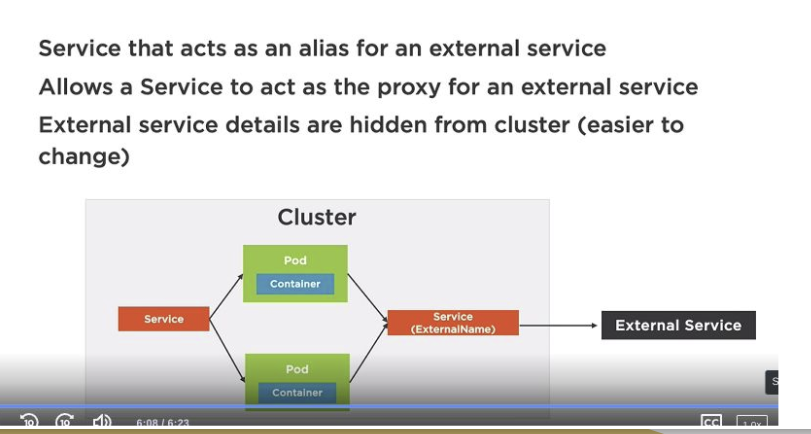

# Kubernetes

serve per gestire i container, per grandi quantità di container e per gestire il loro ciclo di vita.

con il compose noi tiriamo su le immagini non gestiamo scalabilità o relaiability

kubernetes è presente su ogni cloud provider, questo permette di trasferire tra locale e cloud senza cambiare il codice

microservizi va a braccetto con i container e quindi con kubernetes(si comporta come mister di calcio)

posso avere le app nei container e kubernetes si occupa di gestirli

io sviluppo senza usare kubernetes volendo e aggiungere dopo kubernetes

posso fare:

- scheduling: quando e dove far girare i container
- scaling: aumentare o diminuire il numero di container per avere più repliche
- healing: se un container va giù, kubernetes lo riporta su
- updating: aggiornare i container senza downtime

## building blocks

dobbiamo descrivere come vogliamo che kubernetes gestisca i nostri container
composto da:

- pod: contiene un container docker
- service: permette di fare accessi come rete
- deployment: permette di fare scaling e rolling update(gestire repliche)

## cluster

definisco lambiente di esequzione in un file

- master: gestisce il cluster
- node: esegue i container

devo scrivere un file di configurazione per dire a kubernetes come voglio che gestisca i container yaml

possiamo sia lavorare da linea di comando che da interfaccia grafica

possiamo anche gestire moltplici cluster noi ne usiamo uno solo

## kube scheduler

usa i file per mandare in esequzione i container

## master

- ha lo scheduler: decide dove far girare i container
- il controller : gestisce i nodi
- apiserver: gestisce le richieste

con comandi kubectl per interagire con il cluster attraverso apiserver

## node

è un lavoratore, una macchina fisica o virtuale
ha più pods il cui scheduling è gestito da kubernetes

contiene:

- kubelet: agente che accetta richieste e istanzzia i pod e gestiste la comuniczione con lengine
- kube-proxy: gestisce la comunicazione tra i pod
  - tutti i container in un pod hanno lo stessa ip
  - si fa load balane
- container engine: esegue i container (docker)

### manifest file

file yaml che descrive come vogliamo che kubernetes gestisca i container

- apiVersion: versione dellapi
- kind: tipo di oggetto(deployment gestisce le repliche)
- metadata: metadati tipo nome: test
- spec: specifica come vogliamo che kubernetes gestisca i container
  - replicas: numero di repliche
  - selector: come selezionare i pod
    - matchLabels: etichette dei pod
      - app: test
  - template: come creare i pod
    - metadata: metadati del pod
    - spec: specifica del pod
      - containers: lista di container
        - name: nome del container
        - image: immagine del container
        - ports: porte del container
        - containerPort: porta del container

## pods

pod è il vestito container è la persona

i container girano sempre dentro i pod

il pod è unambiente di esecuzione comune

dentro ci sono i container e tutta la configurazione di rete

Tight coupling: i container dentro un pod sono strettamente legati e hanno lo stesso ip ma con porte diverse, sconsigliato
Loose coupling: un container per pod, consigliato, non si condividono risorse

i pod non possono stare tra i vari nodi

### lifecycle

- descrivo i pod in un file yaml e lo passo a apiserver
- passa a pending
- passa a running
- può fallire e passare a failed

PER SCALARE io aggiungo pod non aggiungo container dentro un singolo pod
kubernetes gestisce i pod non i container
dentro i container sono affari nostri

### expose pod

di default i pod non sono esposti all'esterno ma solo all'interno del cluster
per esporre un pod all'esterno devo fare un port forwarding

## service

permette di fare accessi come rete
sempre definito con un file

offre anche funzionalita di gateway: se ho più pod che fanno la stessa cosa, il service fa da gateway e fa il load balancing, ho un solo ip di entrata e il service si occupa di indirizzare la richiesta al pod giusto

gli ip dei pod cambiano spesso(muoiono i pod), il service si occupa di fare da gateway

### dichiarazione tipi di service

- clusterIP: ip interno del cluster(default)
  
- nodePort: ip esterno del cluster con porta statica
  
- loadBalancer: ip esterno del cluster con porta statica e bilanciamento del carico
  
- externalName: risoluzione del nome
  

### continuos deployment

posso avere diverse versioni di un service e alternare le versioni in maniera efficiente
posso fare switch delle immagini che girano nei pod

### repliche

certi pod possono avere più repliche per poter gestire più richieste

### deployment

noi dichiariamo quello che vorremmo che ci sia e kubernetes si occupa di farlo

metadata importanti: label devono essere uguali tra pod e service

I MINIOOOOOOOOOOOOOON

## i dati

i dati sono effimeri, se un pod muore i dati vanno persi
per salvare i dati devo usare un volume
dobbiamo associare un volume al pod
posso definire tutto nel file yaml su cosa e dove salvare i dati

persistent volume claim: dichiaro che voglio un volume persistente

## minikube

riproduce un cluster kubernetes in locale e ha il container runtime docker
