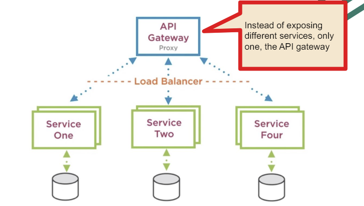

# Microservizi

## Cosè un'architetturaa microservizi?

è unevoluzione della service oriented architecture (SOA) che si basa su servizi autonomi e indipendenti che collaborano tra loro per fornire un servizio complesso.

## Cosè un servizio?

- I servizi diventano ancora più piccoli di SOA
- Ogni servizio ora ha il proprio database, prima no
- è ancora più sconneso dal frontend (posso avere il frontend e una mobile app)
- Il load balancer ora fa parte dellarchitettura stessa e gestisce il traffico tra i server su cui vivono i servizi
- bisogna dividere bene i task dei servizi non uno enorme rispetto agli altri
- usa servizi rest che sono rendono la comunicazione più semplice
- Iportante: sono veramente eterogenei: analisi dati in python, frontend in react, parte centrale in sping, sensori in c, ecc..
- uguale il discorso dei database, ognuno usa il suo

## Benefici

- Più facile la gestione perchè più piccoli, posso riscrivere parti senza toccare il resto
- Deployment individuale: faccio solo testing e deploy dei singoli servizi
- Scalabilità: posso avere servizi più carichi di altri e tramite load balancer posso dare più risorse a questi

## Problemi

- sedevo dare un prototipo magari mi conviene non usare i microservizi, posso poi fare il refactoring dopo per non perdere tempo
- bisogna automatizzare il processo di deployment
- se i servizi diventano troppo piccoli hanno troppa necessità di comunicare gli uni con gli altri e non va bene, troppo interdipendenti
- monitoring: devo monitorare ogni servizio, non posso monitorare tutto insieme

## Perche MICRO?

- lobbiettivo è che siano piccoli, autonomi e indipendenti
- che siano deployabili individualmente
- quanto piccoli?

## I benefici dei monoliti

- più semplice da sviluppare
- più semplice da deployare
- più semplice trovare le cose
- va bene per applicazioni più piccole
- problemi: SCALABILITà tanti sviluppatori, tati dati, tanti utenti, difficile da mantenere

## Collegamento con i cloud

prima solo sas ( software as a service) ora anche paas (platform as a service) e iaas (infrastructure as a service) e ora anche container as a service e function as a service

posso fare deploy su cloud solamente di parti della mia applicazione

## Il problema sono i dati

- i dati sono il problema più grande
- avere tanti database separati potrebbe essere un problema per fare le join
- problema delle transazioni
- problema della consistenza dei dati

## Comunicazione solo tramite api

il frontend non si può collegare direttamente al db

## Differenza tra microservizi e le applicazioni tradizionali

- database: ogni microservizio ha il suo database anche di tipo diverso

## Come fare la comunicazione?

con il fatto che sono tutti indipendenti è meglio avere una comunicazione sincrona RPC ma fare un scambio di messaggi con i MOM.

Tio rabbitMQ: se ho due db clienti e ordini ho dei dati ripetuti e quando faccio un aggiornamente devo anche andare a modificare laltro e a questo punto uso rabbit per scambiare messaggi tra i due servizi

## A cosa servono anche i micro e lisolamento?

a non incorporare librerie allinterno(analisi dati librerie di c) di un servizio ma usarle come servizio esterno in modo che se ci siano errori non si propaghino a tutto il sistema

DOBBIAMO PENSARE IL TUTTO A UN REFACTORING CONTINUO IN SERVIZI SEMPRE PIù PICCOLI

## Problemi diversi database join

- boundaries: quali dati mettere in un db e quali in un altro

## Comunicazione tra microservizi

- Synchronous → Request/Response → Orchestration Architecture
- Asynchronous → Event-based (decoupled services) → Choreography
  Architecture

### API gateway

UN servizio che permette che la parte client non debba conoscere tutti i servizi ma solo il gateway che si occupa di fare il routing

Può racchiudere il load balancer

### Archetettura ad eventi

- uSo un message Bus tipo rabbitMQ

### Ibrido

- uso un po di event driven ma posso anche invocare direttamente un servizio

## Api gateway

- può contenere parti di load balancer e sicurezza

## Eureka

- è un servizio di discovery
- ogni servizio si registra su eureka e poi eureka sa dove sono i servizi
- se un servizio muore eureka lo sa e non lo manda più li
- se un servizio si aggiorna eureka lo sa e lo aggiorna
- se un servizio si aggiunge eureka lo sa e lo aggiunge
- se un servizio si toglie eureka lo sa e lo toglie

<!-- in una situazione con tanti servizi vengono registrati in modo da sapere quali e dove sono quando cè bisogn -->

## Distribuited monoliths

stesso db ma con diversi servizi

## Dettagli

- comunicazione tramite rest con json, sono come dei contratti (v1, v2)
- IMPORTANTE: servono anche per gestirei legacy sistems

### problema duplicated data

- porblema della consistenza dei dati, dati duplicati, come fare le join tra i dati

### problema boundary pitfalls

- boundaries: non avere servizi troppo piccoli con logica separata da altra che si richiama continuamente (CHATTY) e non creare dipendenze circolari

### perchè container

più facilità in deploy e testing

### test

- unit test: veloce, copre tanto codice
- end to end test: testa tutto il sistema, fragile
- service test: testa un singolo servizio, placeholder con gli altrui servizi

### comunicxazione

per avere completa disconnessione dovrebbe essere asincrona tra i servizi

discorso dellibrido: posso usare un po di event driven e un po di sincrono

#### sincrono

non mettere apy gateway se singolo servizio

#### asyncrona

message broker: rabbitMQ per scambiare messaggi tra i servizi

benefici:

- servizi lenti non bloccano i veloci

callbacks: webkook, posso fare un post ad un servizio e poi lui mi fa un post quando ha finito

### patterns di comunicazione

- event bus: un servizio manda un evento e chi è interessato lo riceve (rabbitmq)

## service discovery alternatives

posso usare eureka per trovare i servizi o usare kubernetes che fa da orchestratore e sa dove sono i servizi
bisogna coordinare i servizi, start order, stop order, ecc..

### automatizzare il deploy

automizzo le versioni su git hub e faccio versioning delle immagini docker e poi faccio il deploy su kubernetes

### release pipeline

- ogni servizio ha il suo pipeline di deploy
- ogni servizio ha il suo test
- ogni servizio ha il suo deploy
- ogni servizio ha il suo dev e il suo production

ho dei file yaml che mi dicono come fare il deploy sia per il dev che per il production con db differenti e dice come gestire il tutto
posso anche avere diverse versioni per regioni diverse

### monitoring

controllare che i servizi siano attivi e che non ci siano problemi, kubernetes ha un sistema di monitoring

### upgrade strategies minimal downtime

(SWITCH NEL LOAD BALANCER)
con kubernetes posso fare:

- blue green deployment: ho due ambienti e uno è sempre in produzione e laltro è quello che sto aggiornando
- rolling update: aggiorno un servizio alla volta

### team autonomi

- ogni team ha il suo servizio

### business domain centric

- ogni servizio è legato a un dominio di business
- si fa lanalisi di dominio e si capisce quali servizi fare
- individuare i crud (create, read, update, delete) e fixare i boundary sbagliati(continuo refactoring)

### containers

- ogni servizio è un container
- volume: ogni servizio ha il suo volume

### registration and discovery

- nei cloud ci sono già i registry automatici

## PRINCIPI

- High cohesion: ogni servizio fa una cosa sola bene
- Autonomi: cambiabili e deployabili indipendentemente
- Business domain centric: ogni servizio è legato a un dominio di business
- resilienza: se un servizio muore non deve morire tutto il sistema
- Monitoring: monitorare ogni servizio
- Automatizzare il deploy e il testing

## Greenfield and Brownfield

Come fare il passaggio da un monolite a microservizi? magari anche non tutto

## Greenfield

- posso fare tutto da zero non ho pregresso
- posso fare tutto in microservizi decido
- non c' è legacy code
- non ci sono dipendenze di linguaggio e OS
- raro

## Brownfield

- ho già un sistema funzionante
- già in je avevamo visto di integrare: micro molto buoni
- es. aggiungere moduli e features a un sistema esistente

### Ibridi

- posso fare un po di micro e un po di monoliti
- aggiunte al monolita opure qualcosa che tolgo dal monolita per renderlo scalabile
- cerco le funzionalità che posso dividere che appartengono a un dominio di business e le sposto piano piano
- smusso i confini
- devo fare test
- processo costoso, deve essere un vantaggio trasformare in micro

### Migrazione

- prima non cera bisogno di message broker
- so porta fuori un servizio e si splitta il database
- ma ora ci vuole un message broker per comunicare tra i due e risolvere i problemi di consistenza e aggiornamento (asicrono)
- ora ci vuole anche un sistema di monitoring e central logging per vedere se ci sono problemi
- bisogna dare priorità a certi servizi:
  - rischio: servizi che danno problemi e che sono molto usati
  - tecnologia: cambiare linguaggio o magari db
  - dipendenze

Se lazienda vuole fare il passggio completo con un approccio incrementale e continuo refactoring si arriva a una situazione di soli microservizi

### Db migration

- prima un db ora tanti db
- bisogna fare refactoring anche dei db
- data referential integrity: se ho due db come faccio a fare le join?

### Transazioni

- con i micro servizi ci sono ancora più problemi per le transazioni
- se operazione non va a buon fine come faccio a fare il rollback?
- ora ho più db su cui devo fare il rollback
- ora diventa una necessità avere un sistema di transazioni distribuite

## Greenfield

- posso fare tutto da zero non ho pregresso
- requisiti che evolvono
- subito il dominio non è chiaro
- integrazione con sistemi esistenti

### Primo approccio

- parto da un livello alto generale come le CRC cards: individuo moduli
- da questi moduli posso poi fare i servizi
- se trovo una parte che magari include una libreria o è comune a più servizi la metto in un servizio a parte

## Domain driven design

- analisi di dominio
- cerco di parlare con gli espeerti di dominio
- cercfo entità che evolvono
- cerco i boundary e cerco di non fare servizi troppo piccoli
- loosele coupling: cerco di non fare servizi troppo interdipendenti
- high cohesion: cerco di fare servizi che fanno una cosa sola bene
- Trovare i concetti chiave come crc cards, vedere cosa sta fuori da questi concetti e che dovranno comunicare
- devo farmi aiutare anche sui contesti(ospedale, accessibile solo internamente o esternamente)
- contesti non sono sempre facili da definire
- Aggreghiamo o decomponiamo i servizi in base a come si evolvono

## Asynchronous communication

- di solito meglio le asyncrone
- sempre chaiamre rest per chiamate sincrone
- chi invoca il servizio manda un messaggio su un message broker e poi il servizio lo riceve
- ci sono diversi pattern di invocazione
- unapp è composta da tanti di questi pattern per le sue diverse parti

### Competing workers pattern

- un servizio manda un messaggio e tanti servizi lo ricevono e fanno qualcosa
- publish subscribe
- in una situazione classica non si fa

### Fanout pattern

- un servizio manda un messaggio e tanti servizi lo ricevono e fanno qualcosa in parallelo

### sincrono/asincrono pattern

il client invoca le api di un servizio, inizia un task in background e invia ack e poi usare la callback per dire che è finito

### Facade pattern

- un servizio fa da intermediario tra il client e i servizi

### Proxy pattern

- fa da wrapper per un servizio, si mette davanti a un servizio e fa da intermediario
- per esempio per software legacy

### Stateless service pattern

- ogni volta nella richiesta devo inviare tutto il contesto, nellheader
- chiamate più costose
- rest non tiene lo stato della sessione

### Broker composition pattern

- api o comunicano con i servizi o con message broker
- message broker: fa da composition tra i servizi, mette i task in una queue e li smaltisce tra i servizi

### Aggregator pattern

- web app fa da aggregatore tra i servizi (NON HA BUSINESS LOGIC)
- invoca i servizi direttamente
- consiglio: mantenere la web app scollegata dal sertvizio di aggregazione

### Chained composition pattern

- inizio dellibrido
- web app manda le richieste solo ad un servizio e lui lo passa a catena agli altri senza gateway o broker
- comunicazione sincrona

### Proxy gateway pattern

### Branch composition pattern

- più realistico, ibrido
- mettiamo insieme diversi pattern

## Data consistency

- transazioni distribuite: se un servizio fallisce come faccio a fare il rollback?
- voglio che se cambiano i dati cambino tutti i db con dati ripetuti
- ogni tanto un database unico è meglio se ho troppe chiamate asyncrone

### two phase commit

- devo avere un gestore delle transazioni oppure saga pattern
- più costoso

### Saga pattern

- definisco un log file
- ho un servizio Saga execution coordinator (SEC) che gestisce le richieste di compensazione: se qualcosa va male devo compensare da unaltra parte
- se le richieste vanno a buon fine scrive nei log non fa nulla e termina
- se non va a buon fine deve fare una compensating request e fare un undo delle operazioni fatte altrimenti db inconsistenti
- implementazione sempre con rest e json

### Eventual consistency

- non uso le transazione e in qualche modo scelgo la disponibilità sulla consistenza
- prendo un rischio e aggiungo controlli per gestire a posteriori la consistenza
- solo se le inconsistenze sono rare
- faccio una catch quando avviene linconsistenza

### RIAASUNTO

- brownfield: se ho già un sistema poso avere un sistema ibrido e scollegare solo delle parti in maniera incrementale
- greenfield: posso fare tutto da zero, molto raro, incrementale per modificare i famosi boundary
- architetture: broker, proxy, aggregator, composition, ecc..
- quella pura: solo messaggi asincroni con broker

## Api Gateway

- ho solo una porta di ingresso per il client
- fa da intermediario tra il client e i servizi attraverso le diverse porte

  - altre funzionalità: load balancing, autenticazione, autorizzazione, rate limiting, caching ecc..
  - noi useremo kubernetes che ha già queste funzionalità

- sempre un servizio rest
- fa da fitro, wrapper a gli altri servizi

## RabbitMQ

- come MOM (message oriented middleware) con messaggi asincroni e JMS (java message service)
- fornisce la possibilità di scambiare messaggi tra i servizi
- fornisce il routing dei messaggi
- fornisce il modo per monitorare il funzionamento
- interfaccia web e console
- discponibile su cloud e diversi os

publisher e subscriber

consumer manda un ack per dire che ho ricevuto il messaggio

### exchanges

- informazioni sul messaggio
- name: nome dello scambio
- durability: se lo scambio è persistente, la durata
- auto-delete: se lo scambio viene cancellato quando non serve più
- arguments: argomenti aggiuntivi

### 2 tipi di exchanges

- direct: manda il messaggio a una coda specifica
- fanout: manda il messaggio a tutte le code
  
- topic: manda il messaggio a una coda che ha un certo pattern

  - come pub/sub devo essere iscritto a un topic

- con filtri: posso filtrare i messaggi in base a delle regole
  

### message purging

il broker cancella i messaggi che non sono stati consegnati, pulizia automatica

### usage

- per fare decoupling, non avere invocazione diretta tra i servizi
- scalabilità: non serve che tutti siano connessi strettamente, no bottleneck

# SOAs vs Microservices

<!-- SOAs are Stateful while Microservices are Stateless
● SOAs tend to use Enterprise Service Bus (ESB) while Microservices use a
less elaborate and simple messaging system
● SOAs are composed by more lines of code than Microservices (even less than
100)
● SOAs put more emphasis in reusability whereas Microservices focus on
decoupling as much as possible
● A change in SOAs require a whole change in the monolithic application
● SOAs use more often relational DB whereas Microservices gravitate more
towards non-relational DB  -->

- SOAs sono stateful mentre i microservizi sono stateless
- SOAs tendono ad usare Enterprise Service Bus (ESB) mentre i microservizi usano un sistema di messaggistica meno elaborato e semplice
- SOAs sono composti da più linee di codice rispetto ai microservizi (anche meno di 100)
- SOAs mettono più enfasi sulla riusabilità mentre i microservizi si concentrano sul disaccoppiamento il più possibile
- Un cambiamento nelle SOAs richiede un cambiamento completo nell'applicazione monolitica
- Le SOAs usano più spesso DB relazionali mentre i microservizi gravitano più verso DB non relazionali

# DOMANDE

Domanda: Architettura a microservizi-> definizione con spiegazione e vantaggi ottenibili, su quali standard si basa (soap, web service e rest), spiegazione dettagliata di rest?

Risposta: L'architettura a microservizi è un'evoluzione della service oriented architecture (SOA) che si basa su servizi autonomi e indipendenti che collaborano tra loro per fornire un servizio complesso. I microservizi sono servizi molto piccoli che collaborano tra loro per fornire un servizio complesso. Ogni servizio ora ha il proprio database, prima no. Ogni servizio ora ha il proprio database, prima no. Il load balancer ora fa parte dell'architettura stessa e gestisce il traffico tra i server su cui vivono i servizi. Bisogna dividere bene i task dei servizi non uno enorme rispetto agli altri. Usa servizi rest che rendono la comunicazione più semplice. I microservizi sono veramente eterogenei: analisi dati in python, frontend in react, parte centrale in spring, sensori in c, ecc. I microservizi sono molto più piccoli di SOA. Ogni servizio ora ha il proprio database, prima no. Il load balancer ora fa parte dell'architettura stessa e gestisce il traffico tra i server su cui vivono i servizi. Bisogna dividere bene i task dei servizi non uno enorme rispetto agli altri. Usa servizi rest che rendono la comunicazione più semplice. I microservizi sono veramente eterogenei: analisi dati in python, frontend in react, parte centrale in spring, sensori in c, ecc. I microservizi sono molto più piccoli di SOA. Ogni servizio ora ha il proprio database, prima no. Il load balancer ora fa parte dell'architettura stessa e gestisce il traffico tra i server su cui vivono i servizi. Bisogna dividere bene i task dei servizi non uno enorme rispetto agli altri. Usa servizi rest che rendono la comunicazione più semplice. I microservizi sono veramente eterogenei: analisi dati in python, frontend in react, parte centrale in spring, sensori in c, ecc. I microservizi sono molto più piccoli di SOA. Ogni servizio ora ha il proprio database, prima no. Il load balancer ora fa parte dell'architettura stessa e gestisce

Domanda: architettura a microservizi-> spiegazione dettagliata, spiegazione dettagliata web service rest

Risposta: L'architettura a microservizi è un'evoluzione della service oriented architecture (SOA) che si basa su servizi autonomi e indipendenti che collaborano tra loro per fornire un servizio complesso. I microservizi sono servizi molto piccoli che collaborano tra loro per fornire un servizio complesso. Ogni servizio ora ha il proprio database, prima no. Ogni servizio ora ha il proprio database, prima no. Il load balancer ora fa parte dell'architettura stessa e gestisce il traffico tra i server su cui vivono i servizi. Bisogna dividere bene i task dei servizi non uno enorme rispetto agli altri. Usa servizi rest che rendono la comunicazione più semplice. I microservizi sono veramente eterogenei: analisi dati in python, frontend in react, parte centrale in spring, sensori in c, ecc. I microservizi sono molto più piccoli di SOA. Ogni servizio ora ha il proprio database, prima no. Il load balancer ora fa parte dell'architettura stessa e gestisce il traffico tra i server su cui vivono i servizi. Bisogna dividere bene i task dei servizi non uno enorme rispetto agli altri. Usa servizi rest che rendono la comunicazione più semplice. I microservizi sono veramente eterogenei: analisi dati in python, frontend in react, parte centrale in spring, sensori in c, ecc. I microservizi sono molto più piccoli di SOA. Ogni servizio ora ha il proprio database, prima no. Il load balancer ora fa parte dell'architettura stessa e gestisce il traffico tra i server su cui vivono i servizi. Bisogna dividere bene i task dei servizi non uno enorme rispetto agli altri. Usa servizi rest che rendono la comunicazione più semplice. I microservizi sono veramente eterogenei: analisi dati in python, frontend in react, parte centrale in spring, sensori in c, ecc. I microservizi sono molto più piccoli di SOA. Ogni servizio ora ha il proprio database, prima no. Il load balancer ora fa parte dell'architettura
